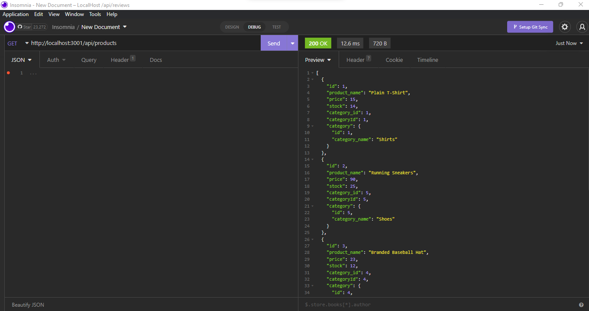
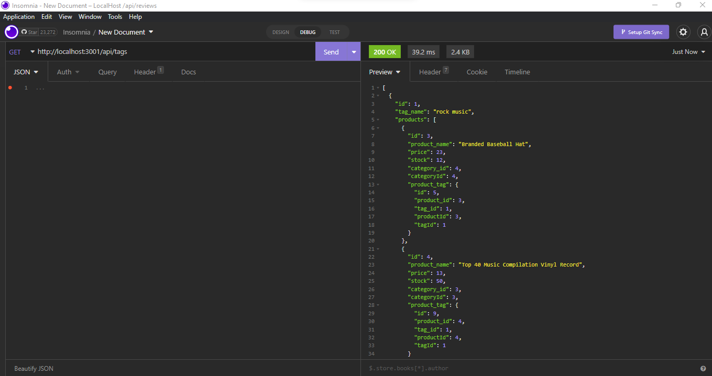
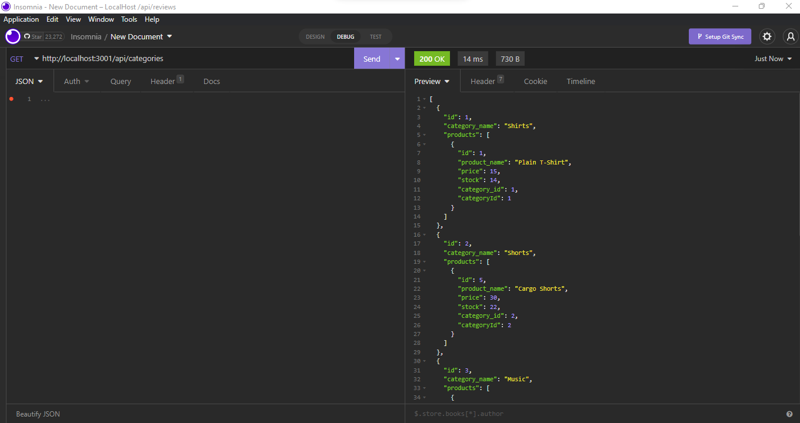

# E-Commerce-Back-End

## Description
This project was created to demonstrate my ability to navigate models, routes, config files, Insomnia and SQL databases and tables. With this tool, you are able to navigate, view, update, create, and delete different items from an E-Commerce database. With the ability to navigate the backend of this project, it will be easy in the future to develop a front end to help users manage their database in an easy fasion. After creating and seeding the database, you are able to do an 'npm start' command to start your express web server. Following, you can open and run Insomnia to GET, POST, PUT, and DELETE, products, tags, and categories. 

## Walkthrough Video Link
[https://drive.google.com/file/d/1yhnzJotbWl4pffoTwDV9P3fJMKJXkRE6/view?usp=sharing](https://drive.google.com/file/d/1yhnzJotbWl4pffoTwDV9P3fJMKJXkRE6/view?usp=sharing)

## Screenshot
### Products GET Route

### Tags GET Route

### Categories GET Route

